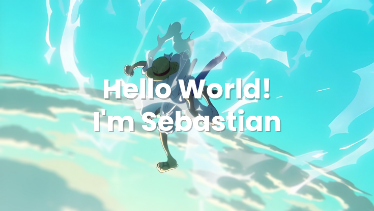

# Hello World I'm Sebastian👋

Hi, I’m a passionate Informatics student at SMK Galajuara. I’m deeply fascinated by the world of frontend development, always eager to push boundaries and explore the latest in web technologies. My goal is to become a skilled bug hunter, crafting secure, innovative solutions and uncovering vulnerabilities to make the digital world safer.

I thrive on turning creative ideas into seamless, interactive experiences with clean, efficient code, whether it’s building responsive websites or diving into ethical hacking challenges. Let’s connect, explore my projects, and create something extraordinary together! 🚀💻

## 🌐Skills

  

